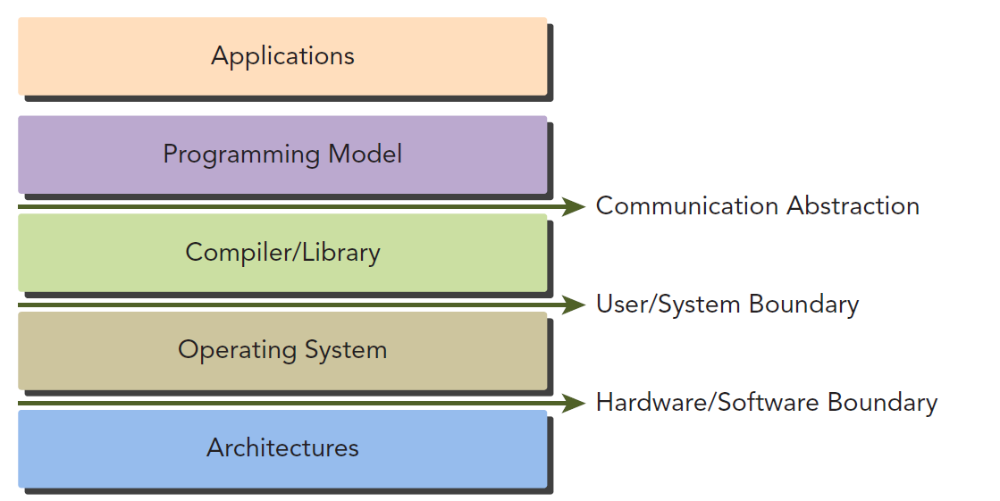
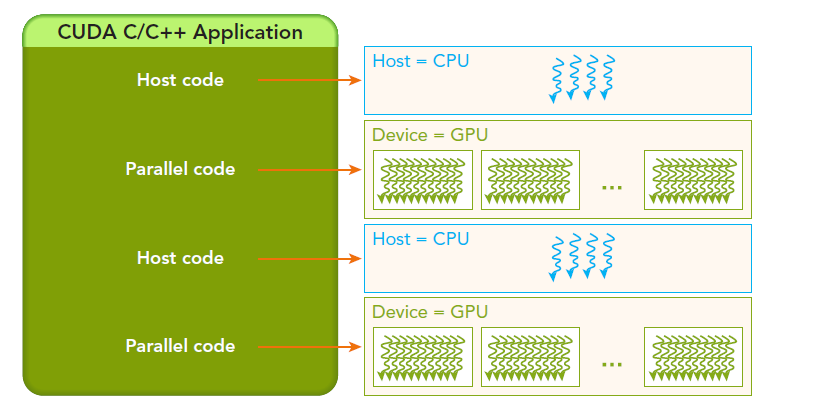

- [Introduction](#introduction)
  - [CUDA Programming structure](#cuda-programming-structure)
    - [Unified Memory](#unified-memory)
    - [Managing Memory](#managing-memory)

# Introduction

Programming models present an abstraction of computer architectures that act as a bridge between an application and its implementation on available hardware.

The **communication abstraction** is the boundary between the program and the programming model implementation, which is realized through a compiler or libraries using privileged hardware primitives and the operating system.



**CUDA PROGRAMMING MODEL** provides specific features:

1. A way to organize the threads on the GPU through a hierarchy sturcture.

2. A way to acess memory on GPU through a hierarchy structure.

Parallel computation levels:

- domain level
- logic level
- hardware level

**DOMAIN LEVEL:** how to decompose the data and function so as to solve the problem efficiently and correctly while running in a parallel env

>[!NOTE]
>Managing concurrent threads should be the focus while programming.

## CUDA Programming structure

This model enables us to execute applications on heterogenous computing systems by annotating code with set of extensions to ANSI C.

A heterogeneous environment consisits of CPUs complemented by GPUs, each with its **own memory separaeted by a PCI-Express bus** 

- *HOST -* the CPU and its memory (host memory)
- *DEVICE -* the GPU and its memory (device memory)

variable `h_` for host mem, `d_` for device memory.

### Unified Memory

1. Introduced in CUDA 6
2. It bridges the divide between host and device memory spaces.
3. It allows us to acess both CPU and GPU memory using **single pointer**, while system automatically migrates the data between the host and device.

>[!IMPORTANT]
>*Kernel* is key component in the cuda programming model(the code that runs on the GPU device)

- Host operates independetly of the device for most operations.
- When a kernel has been launched, control is returned immediately to the host, freeing the CPU to perform additional tasks complemented by data parallel code running on the device.
- CUDA Programming model is **primarily asynchronous** so that GPU computation performed on the GPU can be overlapped with host-device communication.
- Usually CUDA program consists of *serial code* complemented by *parallel code*.



### Managing Memory

| C functions | CUDA functions |
| ----------- | -------------- |
| malloca     | cudaMalloc     |
| memcpy      | cudaMemcpy     |
| memset      | cudaMemset     |
| free        | cudaFree       |

Function to perform GPU mem allocation is `cudaMalloc`, its function signature is:

```c
cudaError_t cudaMalloc (void** devPtr, size_t size)
```
Function to transfer data between host and device is `cudaMemcpy`, its function signature is:

```c
cudaError_t cudaMemcpy (void* dst, const void* src, size_t count, cudaMemcpyKind kind)
```

It copies specified byts from source mem area, pointed to by `src` to destindation mem area, pointed to by `dst`, with the direction specified by `kind`.

`kind` takes one of the following types:

- cudaMemcpyHostToHost
- cudaMemcpyHostToDevice
- cudaMemcpyDeviceToHost
- cudaMemcpyDeviceToDevice

>[!NOTE]
> 1. This function exhibits *synchronous behaviour* because the host applicatoin blocks until `cudaMemcpy` return and the transfer is complete.
> 2. Every CUDA call, except kernel launches, returns an error code of an enumerated type **`cudaError_t`**
> For example: if GPU mem is successfully allocated then it returns **`cudaSuccess`**, otherwise it returns **`cudaErrorMemoryAllocation`**
> To convert error code to human-readable error msg we use the following runtime function
>    ```c
>    char* cudaGetErrorString(cudaError_t error)
>    ```

