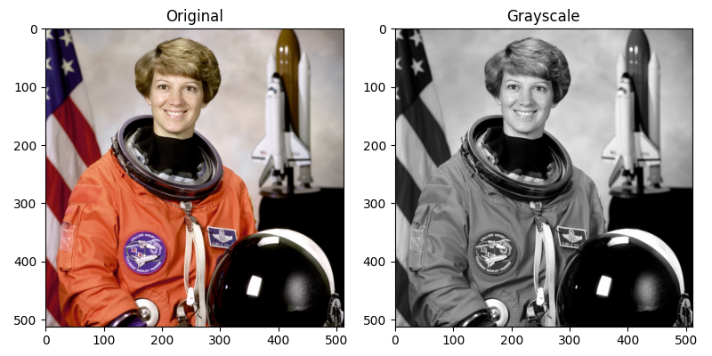
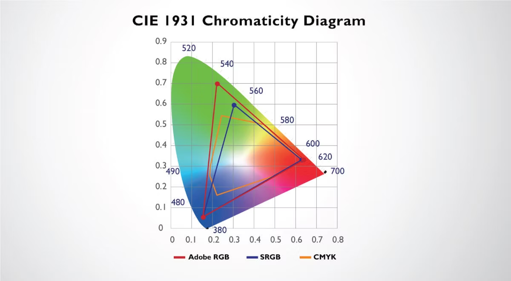

# RGB to Grayscale

To convert the *RGB* image to *Grayscale* image, we have to compute the **luminance value L** for each pixel by applying the following weighted sum formula:

$$L = r\cdot0.21 + g\cdot0.72 + b\cdot0.07$$

## RGB color image representation

- In RGB representation, each pixel is stored as a tuple of (r,g,b) values.

- The format of an image's row is (r g b) (r g b) ... (r g b)

 - Each tuple specifies a mixture of red, green and blue. That is, for each pixel, the r, g and b values represent the intensity (0 being dark and 1 being full intensity) of the rgb light sources when pixel is rendered

In AdobeRGB color space valid combinations of the three colors are shown as interior of the *triangle.*

- vertical coordinate = y-value = frac. of pixel intensityg of **GREEN**
- horizontal coordinate = x-value = frac. of pixel intensityg of **RED**
- remaining frac. = (1-x-y) = frac. of pixel intensityg of **BLUE**
- **TOTAL INTENSITY = (r, g, b) = (x, y, 1-x-y)**

1. **Lightness** method avergaes the most prominent and least prominent colors:
   $\dfrac{\mathrm{max(R, G, B) + \mathrm{min(R, G, B)}}}{2}$

2. **Average** method simply averages the values:
   $\dfrac{(R+G+B)}{3}$

3. **Luminosity** method is advanced version of the average method. It also averages the values but it forms a weighted average to account for human perception. We’re more sensitive to green than other colors, so green is weighted most heavily.
   $R\cdot0.21 + G\cdot0.72 + B\cdot0.07$

>[!NOTE]
>This luminosity formula is for ITU-R Recommendation BT. 709

4. **RGB2GRAY function**, as stated in *cvtColor() documentation*:
   $0.299\cdot R + 0.587\cdot G + 0.114\cdot B$

5. Other coefficients: **CCIR 601, SMPTE 240M** etc
   
### References

1. PMPP, C02x1, Data parallelism
2. [More on color image encoding by Adobe](https://www.adobe.com/digitalimag/pdfs/AdobeRGB1998.pdf)
3. [Conversion formulae](https://www.johndcook.com/blog/2009/08/24/algorithms-convert-color-grayscale/)
4. [Luma](https://www.wikiwand.com/en/articles/Luma_%28video%29)